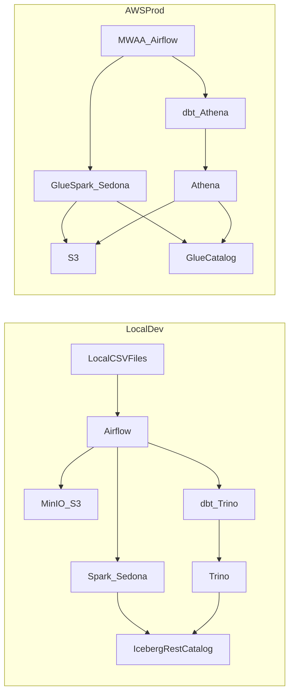

# Local-First AWS Lakehouse Plan (Geospatial, Airflow+dbt, Local→AWS) — v3

## What changed vs v2

- **Orchestration**: Replace **Dagster** with **Apache Airflow**.
  - **Local**: Airflow runs in Docker Compose.
  - **AWS**: Airflow runs on **Amazon MWAA**.
- **Transformations**: Use **dbt for Silver→Gold** modeling, tests, and documentation.
  - **Local dbt target**: **Trino** (dbt-trino) querying Iceberg tables.
  - **AWS dbt target**: **Athena** (dbt-athena) querying Iceberg tables registered in Glue.

## Architecture (local and AWS)

## Data layers and contracts

### Bronze (raw landing)

- **Object key**: `course_id=.../ingest_date=YYYY-MM-DD/<filename>` (optional `event_year/event_month`).
- **Contract**: file readable, non-empty, `_id` present, and at least one `locations[0].startTime` present.

### Silver (conformed, long; Iceberg)

- Produced by Spark/Sedona (local Spark; AWS Glue Spark in prod).
- **Coordinates source**: `locations[i].fixCoordinates[0]` (lon) and `locations[i].fixCoordinates[1]` (lat).
- **Partitioning**: Iceberg partitions by `course_id` + `event_date` (derived from `fix_timestamp`).

Primary tables:

- `silver.fact_telemetry_event`
- `silver.fact_device_health`

**Dedup rule**: for same `(round_id, fix_timestamp)` prefer `is_cache=true`.

### Gold (analytics; Iceberg)

- Produced by **dbt models** reading Silver and writing Gold.
- Example tables:
  - `gold.pace_summary_by_round`
  - `gold.signal_quality_rounds`
  - `gold.device_health_errors`

## Validation and data quality (fail fast + quarantine)

- **Bronze validations**: cheap schema/header + non-empty checks; on failure, write a structured report to quarantine and fail the Airflow task.
- **Silver validations**: parsing rates + lat/lon ranges + required keys not-null + dedup rate metrics; on failure, quarantine + raise.
- **Gold validations** (dbt-native): schema tests (`not_null`, `unique`, `accepted_range`) plus custom tests for geospatial sanity.

## Orchestration plan (Airflow)

### DAG design

- Use a single pipeline DAG with clear task boundaries:
  - `bronze_upload` (PythonOperator)
  - `silver_etl` (Spark submit locally; Glue job in AWS)
  - `silver_validate` (Spark/SQL validation step)
  - `gold_dbt_run` (dbt run)
  - `gold_dbt_test` (dbt test)
  - optional `maintenance_compact` (Iceberg maintenance)

### Local execution

- Airflow runs in Docker Compose.
- Use the DockerOperator (or BashOperator) to run dbt inside a container image.

### AWS execution (MWAA)

- MWAA schedules and monitors:
  - **Glue jobs** for Silver ETL.
  - **dbt runs** executed by MWAA tasks (option A) or by a container target (future option).

> Note: MWAA has packaging constraints. The plan will include a “minimal friction” packaging approach: store DAGs in S3; keep dbt project and profiles in the MWAA DAGs/plugins bundle (or downloaded from S3 at runtime), and keep secrets in AWS Secrets Manager.

## dbt plan (Silver→Gold)

### dbt project layout

- Create a dbt project (example path): [`transformations/dbt_tagmarshal/`](transformations/dbt_tagmarshal/)
  - `models/gold/` for Gold models
  - `models/intermediate/` for reusable transforms
  - `tests/` for custom tests
  - `macros/` for shared logic

### dbt adapters and profiles

- **Local**: `dbt-trino` profile points at local Trino.
- **AWS**: `dbt-athena` profile points at Athena workgroup + S3 staging + Glue Catalog.
- Use targets:
  - `local`
  - `aws`

### Model strategies

- Start with **view/table** models for simplicity.
- Move to **incremental** models where needed (e.g., daily partitioned aggregates keyed by `event_date` + `course_id`).

### Testing + docs (junior-friendly learning path)

- Add dbt tests early:
  - `not_null` for `round_id`, `fix_timestamp`
  - range tests for lat/lon
  - uniqueness tests where appropriate (e.g., surrogate keys)
- Use `dbt docs generate` to learn lineage.

## Local↔AWS config switching (config-only)

- Keep env-file driven configuration:
  - `config/local.env`
  - `config/aws.env`
- Airflow connections/variables:
  - local uses `.env` and local connections
  - MWAA uses Airflow Connections populated via Secrets Manager

## Developer experience (simple commands)

- Keep a `Justfile` but adjust commands to Airflow:
  - `just up` / `just down`
  - `just airflow-ui`
  - `just trigger pipeline`
  - `just dbt-run` / `just dbt-test`
  - `just reset-local`

## AWS cutover (MWAA + Glue + Athena + Iceberg)

- **S3 buckets**: `tm-lakehouse-{bronze,silver,gold,quarantine}`
- **Glue**: database + Iceberg table registrations
- **Athena**: workgroup + output location + sample queries
- **MWAA**:
  - environment in private subnets
  - IAM role permitting Glue start/get job runs, read/write S3 buckets, read Secrets Manager
  - DAGs + plugins uploaded to MWAA S3 bucket
- **Observability**: CloudWatch logs for MWAA + Glue; structured task logs.

## Files you will touch (when executing)

- Local stack: [`/Users/karinlouw/Documents/Personal/Projects/github/tagmarshal_data_lakehouse/docker-compose.yml`](/Users/karinlouw/Documents/Personal/Projects/github/tagmarshal_data_lakehouse/docker-compose.yml)
- Docs: [`/Users/karinlouw/Documents/Personal/Projects/github/tagmarshal_data_lakehouse/docs/runbook_local_dev.md`](/Users/karinlouw/Documents/Personal/Projects/github/tagmarshal_data_lakehouse/docs/runbook_local_dev.md)
- Replace Dagster project with Airflow:
  - New: `orchestration/airflow/dags/tm_lakehouse_pipeline.py`
  - New: `orchestration/airflow/plugins/` (helpers/operators if needed)
- dbt project:
  - New: `transformations/dbt_tagmarshal/` (models/tests/macros)
- Keep/reuse existing ETL code:
  - [`/Users/karinlouw/Documents/Personal/Projects/github/tagmarshal_data_lakehouse/orchestration/dagster_project/assets/bronze.py`](/Users/karinlouw/Documents/Personal/Projects/github/tagmarshal_data_lakehouse/orchestration/dagster_project/assets/bronze.py)
  - [`/Users/karinlouw/Documents/Personal/Projects/github/tagmarshal_data_lakehouse/orchestration/dagster_project/assets/silver.py`](/Users/karinlouw/Documents/Personal/Projects/github/tagmarshal_data_lakehouse/orchestration/dagster_project/assets/silver.py)
  - [`/Users/karinlouw/Documents/Personal/Projects/github/tagmarshal_data_lakehouse/orchestration/dagster_project/assets/gold.py`](/Users/karinlouw/Documents/Personal/Projects/github/tagmarshal_data_lakehouse/orchestration/dagster_project/assets/gold.py)

> During execution we’ll migrate logic from Dagster assets into Airflow tasks (and remove Dagster once parity is achieved).

## Learning-by-building (how we’ll work together)

- We’ll implement one vertical slice end-to-end first (one dataset → Bronze → Silver → one Gold model), then generalize.
- Each PR/step will include:
  - a short “what you learned” note (Airflow concept + dbt concept)
  - one small exercise (e.g., add a dbt test, add an Airflow retry policy)