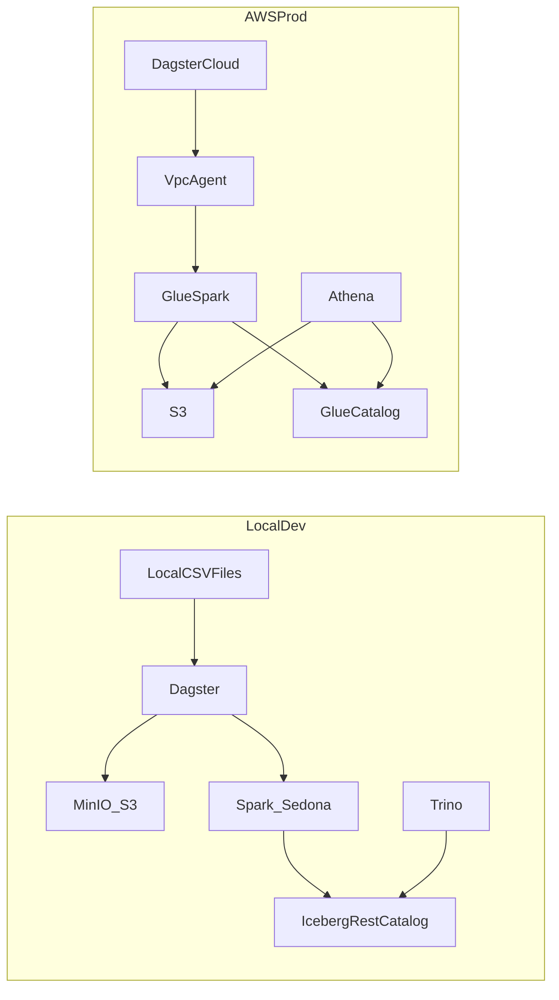

# Local-First AWS Lakehouse Plan (Geospatial, Local→AWS) — v2

## What you asked to change (incorporated)

- **Partitioning**: Clarified **Bronze** vs **Silver** partitioning for full-history loads.
- **Easy commands**: Add a `Justfile` with “just run it” workflows.
- **Logging + errors**: Prefer **structured logging** and **raise** (fail fast) instead of warn/skip.
- **All datasets supported**: Align the Silver parsing to the real CSV headers (notably `locations[i].fixCoordinates[0/1]`).
- **Validation / data quality**: Add gates and quarantine behavior.
- **Config-only switch local→AWS**: Introduce env-file driven configs; keep everything local in Docker.

## Key design choices

- **AWS control plane**: **S3 + Iceberg + Glue Data Catalog + Athena**.
- **Orchestration**: **Dagster Cloud** (agent in VPC) triggers Glue jobs.
- **Geospatial**: Apache Sedona + (optional) H3 indexing.

## Partitioning strategy (answer to your ingest_date question)

### Bronze (raw landing)

**Recommendation**: keep Bronze partitioned by **`course_id` + `ingest_date`**.

- **Why**: Bronze is primarily for lineage/auditing/replay, not for analytics queries. `ingest_date` gives idempotency, observability, and easy reprocessing.
- **Full-history load**: you will ingest many old events in one day; *that’s fine* in Bronze because Bronze shouldn’t be the query surface.

**Optional improvement** (nice-to-have): include a coarse event prefix derived from the row-level `startTime` (round start time) **without replacing** `ingest_date`:

- `course_id=.../event_year=YYYY/event_month=MM/ingest_date=YYYY-MM-DD/<filename>`
- This helps if you later want to sample Bronze by event period, but it’s not required.

### Silver (analytics surface)

**Recommendation**: partition by **event time** derived from `locations[i].startTime`.

- Add `event_date` (and optionally `event_year`, `event_month`) derived from `fix_timestamp`.
- This is what makes Athena/Trino pruning efficient.

## Dataset reality check (your data)

Across your datasets (`americanfalls`, `bradshaw*`, `erinhills`, `indiancreek`, `pinehurst4`):

- They all have the “wide locations array” pattern.
- **Coordinates are encoded as** `locations[i].fixCoordinates[0]` (lon) and `locations[i].fixCoordinates[1]` (lat). They are **not** a single `locations[i].fixCoordinates` column.
- `captureLogs` exists (at least for Indian Creek; appears on others too).
- `goalName`, `goalTime`, `goalTimeFraction` exist in multiple datasets.

This drives how Silver ETL must be written (superset schema + correct coordinate extraction).

## Local stack (Docker) and AWS mapping

### Local (Docker Compose)

- **MinIO** buckets: `tm-lakehouse-{bronze,silver,gold,quarantine}`
- **Spark**: Spark 3.5 with Sedona packages
- **Catalog**: Iceberg REST (local-only convenience)
- **SQL**: Trino (local-only convenience)
- **Orchestration**: Dagster container

### AWS (Production)

- **S3** buckets: `tm-lakehouse-{bronze,silver,gold,quarantine}`
- **Catalog**: Glue Data Catalog (Iceberg)
- **Compute**: AWS Glue Spark jobs (Sedona deps)
- **SQL**: Athena
- **Orchestration**: Dagster Cloud agent in VPC

## Data layers and table contracts

### Bronze (raw)

- **Object key**: `course_id=.../ingest_date=YYYY-MM-DD/<filename>` (optional `event_year/event_month`).
- **Contract**: file exists, readable CSV, non-empty, `_id` present.

### Silver (conformed, long)

Primary tables:

- `silver.fact_telemetry_event`
  - `round_id`, `course_id`
  - `fix_timestamp`
  - `hole_number`, `section_number`
  - `longitude`, `latitude`
  - `geometry` (Sedona point)
  - `h3_index` (optional/if function available)
  - `data_quality_tier` from `isProjected`
  - `is_cache`, `is_projected`, `pace_gap`, `positional_gap`, `pace`, battery fields (where present)
  - `event_date`, `event_year`, `event_month` derived from `fix_timestamp`
- `silver.fact_device_health`
  - `round_id`, `course_id`, `device_log_json`

**Dedup rule**: for same `(round_id, fix_timestamp)` choose `is_cache=true` first.

### Gold (analytics)

- `gold.pace_summary_by_round`
- `gold.signal_quality_rounds`
- `gold.device_health_errors`

## Validation and data quality checks (fail fast + quarantine)

Add validations at two points:

- **Bronze upload validation** (cheap):
  - file readable, header contains `_id`, `course`, and at least one `locations[0].startTime`
  - record count > 0
- **Silver validation** (real quality):
  - `fix_timestamp` parses (non-null rate threshold)
  - latitude in [-90, 90], longitude in [-180, 180]
  - required keys not null: `round_id`, `course_id`
  - duplicate rate threshold for `(round_id, fix_timestamp)` tracked
  - optional: detect obviously swapped lat/lon (abs(lat) > 90 etc.)

**Behavior**:

- If validation fails: write a structured error report to `tm-lakehouse-quarantine/...` and **raise** so the Dagster run is red.

## Logging and error-handling standards

- Use `context.log.info/debug/error` with structured metadata.
- Do not silently “skip” on missing data unless explicitly configured (dev-only toggle).
- Raise exceptions on:
  - no input files found when you expect them
  - schema mismatch beyond allowed drift
  - failed writes to Iceberg/S3

## Config-only switching (local ↔ AWS)

Goal: switch environments by swapping **env files**, not code.

### Proposed config layout

- `config/local.env` (MinIO endpoint + static keys)
- `config/aws.env` (no endpoint override; use IAM role in AWS; placeholders for local dev)

### Docker usage

- Local:
  - `docker compose --env-file config/local.env up -d`
- AWS execution context:
  - Glue jobs use their own job parameters/roles; Dagster Cloud agent uses AWS IAM.

### Spark catalog switching

- Local Spark uses Iceberg REST catalog (already in compose).
- AWS Spark uses Glue Catalog (`GlueCatalog`) for Iceberg.
- Keep table/database names consistent; only the catalog prefix changes.

## “Just” commands (developer experience)

Add a `Justfile` with commands like:

- `just up` / `just down` / `just logs`
- `just ui` (prints URLs)
- `just bronze-upload`
- `just silver`
- `just gold`
- `just compact`
- `just reset-local` (dangerous: wipe volumes)

## Implementation phases

### Phase 1 — Fix Silver extraction to match real headers

- Update Silver ETL to build structs with:
  - `fix_timestamp_raw` from `locations[i].startTime`
  - `longitude` from `locations[i].fixCoordinates[0]`
  - `latitude` from `locations[i].fixCoordinates[1]`
  - optional metrics: `paceGap`, `positionalGap`, `pace`, battery, heldUp/holdingUp
- Ensure superset behavior across datasets (missing columns become nulls).

### Phase 2 — Partitioning and table layout

- Bronze keys: `course_id/ingest_date` (+ optional `event_year/month`).
- Silver Iceberg partitions: `course_id`, `event_date` (or year/month).

### Phase 3 — Data quality gates + quarantine

- Add validation assets/ops with explicit thresholds.
- Emit quarantine objects + raise errors.

### Phase 4 — DX: `Justfile` + docs

- Add runbook section with `just` commands.

### Phase 5 — AWS cutover plan (managed)

- S3 buckets + IAM + Glue databases
- Glue Spark jobs for Silver/Gold + Sedona deps
- Athena workgroup + sample queries
- Dagster Cloud agent in VPC triggers Glue jobs

## Files you will touch (when you start executing)

- Local stack: [`docker-compose.yml`](/Users/karinlouw/Documents/Personal/Projects/github/tagmarshal_data_lakehouse/docker-compose.yml), [`docs/runbook_local_dev.md`](/Users/karinlouw/Documents/Personal/Projects/github/tagmarshal_data_lakehouse/docs/runbook_local_dev.md)
- Dagster assets: [`orchestration/dagster_project/assets/bronze.py`](/Users/karinlouw/Documents/Personal/Projects/github/tagmarshal_data_lakehouse/orchestration/dagster_project/assets/bronze.py), [`orchestration/dagster_project/assets/silver.py`](/Users/karinlouw/Documents/Personal/Projects/github/tagmarshal_data_lakehouse/orchestration/dagster_project/assets/silver.py), [`orchestration/dagster_project/assets/gold.py`](/Users/karinlouw/Documents/Personal/Projects/github/tagmarshal_data_lakehouse/orchestration/dagster_project/assets/gold.py), [`orchestration/dagster_project/assets/ops.py`](/Users/karinlouw/Documents/Personal/Projects/github/tagmarshal_data_lakehouse/orchestration/dagster_project/assets/ops.py)
- Config: `config/local.env`, `config/aws.env`
- DX: `Justfile`