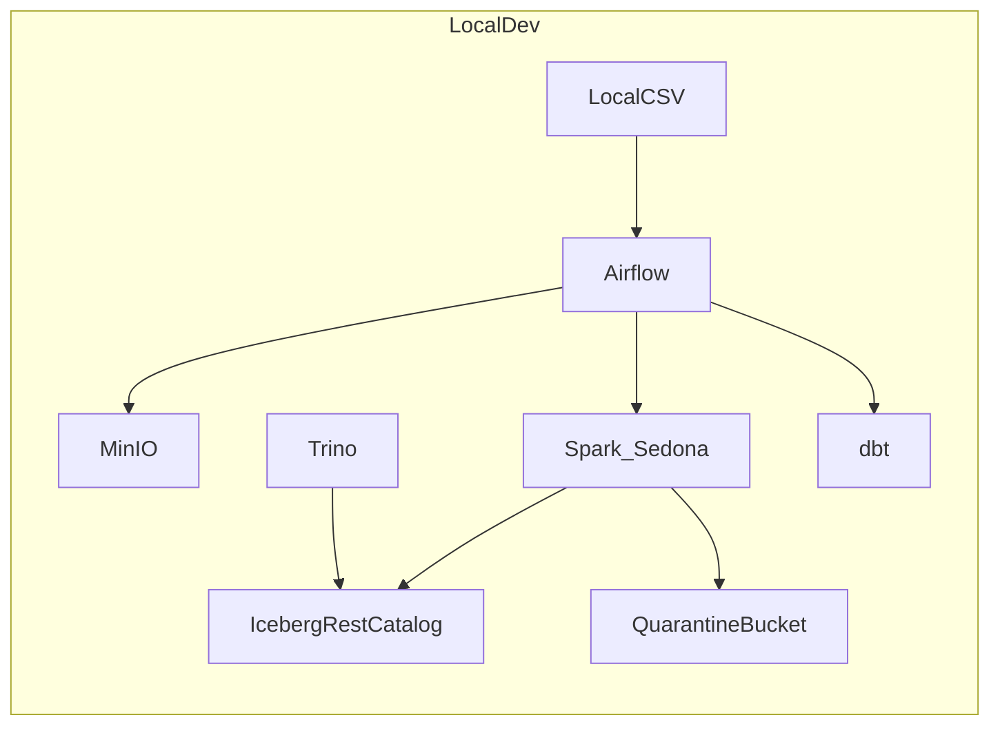

# Local-First AWS Lakehouse (Geospatial) — Build Plan (dbt DQ + Observability)

## Goals

- Stand up a **local-first** lakehouse that ingests CSV telemetry into **Bronze** (raw) and produces **Silver** Iceberg tables with correct coordinate extraction (`locations[i].fixCoordinates[0/1]`).
- Use **dbt for data quality** (tests + freshness + gating) and keep ETL **fail-fast** with **quarantine outputs** for invalid inputs.
- Provide **logging + observability** suitable for development and a clear upgrade path to production.
- Provide a **config-only** switch from local (MinIO + REST catalog) to AWS (S3 + Glue Catalog).
- Provide **junior-friendly learning supports** embedded in the repo (runbook, glossary, “why this exists” notes, examples).

## Repo scaffold (greenfield)

The repo currently contains only your design doc (`[local-first_aws_lakehouse_(geospatial)_v2_updated.md](/Users/karinlouw/Documents/Personal/Projects/github/tagmarshal_data_lakehouse/local-first_aws_lakehouse_\\\\\\\\\\\\\(geospatial)_v2_updated.md)`), so we’ll create everything below.

- **Local stack**: [`docker-compose.yml`](/Users/karinlouw/Documents/Personal/Projects/github/tagmarshal_data_lakehouse/docker-compose.yml) (MinIO, Spark, Iceberg REST catalog, Trino, Airflow + Postgres)
- **Orchestration (Airflow)**: [`orchestration/airflow/`](/Users/karinlouw/Documents/Personal/Projects/github/tagmarshal_data_lakehouse/orchestration/airflow) (DAGs + Docker config)
- **ETL code (Spark)**: [`jobs/spark/`](/Users/karinlouw/Documents/Personal/Projects/github/tagmarshal_data_lakehouse/jobs/spark)
- **Transforms + data quality (dbt)**: [`transform/dbt_project/`](/Users/karinlouw/Documents/Personal/Projects/github/tagmarshal_data_lakehouse/transform/dbt_project)
- **Config**: [`config/local.env`](/Users/karinlouw/Documents/Personal/Projects/github/tagmarshal_data_lakehouse/config/local.env), [`config/aws.env`](/Users/karinlouw/Documents/Personal/Projects/github/tagmarshal_data_lakehouse/config/aws.env)
- **Docs + learning**: [`docs/runbook_local_dev.md`](/Users/karinlouw/Documents/Personal/Projects/github/tagmarshal_data_lakehouse/docs/runbook_local_dev.md), [`docs/learning/`](/Users/karinlouw/Documents/Personal/Projects/github/tagmarshal_data_lakehouse/docs/learning)
- **DX**: [`Justfile`](/Users/karinlouw/Documents/Personal/Projects/github/tagmarshal_data_lakehouse/Justfile)

## Data contracts

### Bronze (raw landing)

- **Object key**: `course_id=.../ingest_date=YYYY-MM-DD/<filename>`.
- **Bronze validation** (cheap): file readable, non-empty, required header columns exist.

### Silver (Iceberg)

Primary tables:

- `silver.fact_telemetry_event` (long)
- `fix_timestamp` from `locations[i].startTime`
- `longitude` from `locations[i].fixCoordinates[0]`
- `latitude` from `locations[i].fixCoordinates[1]`
- `event_date` derived from `fix_timestamp`
- `geometry` (Sedona point)
- optional `h3_index`
- **Dedup**: for `(round_id, fix_timestamp)` prefer `is_cache=true`
- `silver.fact_device_health` with log payload fields (e.g. `captureLogs`) stored as JSON/string

### Quarantine

- Structured error reports written to `tm-lakehouse-quarantine/...`.
- Airflow tasks **raise** on validation failure (visible failures, no silent skips).

## Data flow (local)

## Observability (logging + run metadata)

### Minimum (local dev, day-1)

- **Structured logs** everywhere (Airflow tasks, Spark jobs, dbt runs) with consistent fields:
- `run_id`, `dag_id`, `task_id`, `course_id`, `ingest_date`, `input_path`, `output_table`, `row_count`, `duration_ms`, `status`
- **Airflow UI** as the primary run monitor.
- **dbt artifacts** (`manifest.json`, `run_results.json`) persisted per run to a known location (local volume / MinIO path) for later inspection.

### Next (still local, good learning + real value)

- Add lightweight metrics:
- row counts per stage
- invalid row counts / failure reasons
- duplicate rates for `(round_id, fix_timestamp)`
- Emit a small “run summary” JSON per job into MinIO (e.g. `observability/runs/<run_id>.json`).

*(We’ll keep this pragmatic: dashboards can be added later (e.g. Grafana/Prometheus/OpenTelemetry) once the pipeline is stable.)*

## Data quality (dbt-first)

### What dbt will do

- **Schema tests** (dbt built-in + dbt-utils where useful):
- `not_null`: `round_id`, `course_id`, `fix_timestamp`
- `accepted_range`: `latitude` in [-90, 90], `longitude` in [-180, 180]
- `unique`/`unique_combination_of_columns` (where appropriate, e.g. `(round_id, fix_timestamp, device_id)` if device_id exists)
- **Freshness**: define source freshness checks for the Silver tables (local and AWS).
- **Custom tests** for:
- swapped lat/lon detection heuristics
- duplicate rate threshold (fail if above threshold)
- **Gating**: Airflow runs `dbt test` after Silver write; failures fail the DAG.

### What Spark will still do (and why)

- **Bronze-level cheap validation** (to avoid garbage-in)
- **Hard parse failures** (e.g. unreadable files) should still fail early
- For row-level issues, Spark can optionally produce:
- a quarantined subset (bad rows) where feasible
- a run-level failure report

## Implementation steps

### 1) Local infrastructure (Docker)

- Create `docker-compose.yml` with MinIO, Iceberg REST catalog, Spark (Sedona+Iceberg), Trino, Airflow+Postgres.

### 2) Config-only switching (local ↔ AWS)

- Env-file driven configuration for:
- storage endpoint
- Iceberg catalog type (REST vs Glue)
- bucket names/prefixes
- database/table names

### 3) Bronze ingest

- Airflow task to discover local CSVs, validate headers, upload to Bronze key layout.

### 4) Silver ETL (Spark)

- Explode locations array into long events.
- Map timestamps and coordinates correctly.
- Write Iceberg partitions: `course_id`, `event_date`.

### 5) dbt data quality gate

- Define dbt sources/models for the Silver tables.
- Add tests + (optional) freshness.
- Airflow task: `dbt test` immediately after Silver; fail DAG if tests fail.

### 6) Gold (dbt models)

- Create a couple initial Gold models:
- `gold.pace_summary_by_round`
- `gold.signal_quality_rounds`
- `gold.device_health_errors`

### 7) Logging + run summaries

- Standardize structured logging for Spark and Airflow operators.
- Persist dbt artifacts and a compact run summary JSON to MinIO.

### 8) DX + learning supports

- `Justfile` for one-command workflows.
- Runbook with “happy path”, troubleshooting, and "what to look at when a run fails".
- Add short learning notes in `docs/learning/`:
- `lakehouse_layers.md` (Bronze/Silver/Gold)
- `iceberg_basics.md` (why Iceberg, partitions vs files)
- `dbt_testing_101.md` (tests, sources, freshness, severity)
- `airflow_101.md` (DAGs, retries, XCom, params)
- `how_to_debug_runs.md` (Airflow logs, Spark logs, dbt artifacts)

## AWS cutover plan (production mapping)

- **S3** buckets: `tm-lakehouse-{bronze,silver,gold,quarantine}`.
- **Catalog**: Glue Data Catalog for Iceberg.
- **Compute**: Glue Spark jobs for Silver (Sedona deps packaged).
- **SQL**: Athena.
- **Orchestration**: Airflow triggers Glue jobs + dbt runs against Athena (`dbt-athena`).
- Deliver a checklist for: