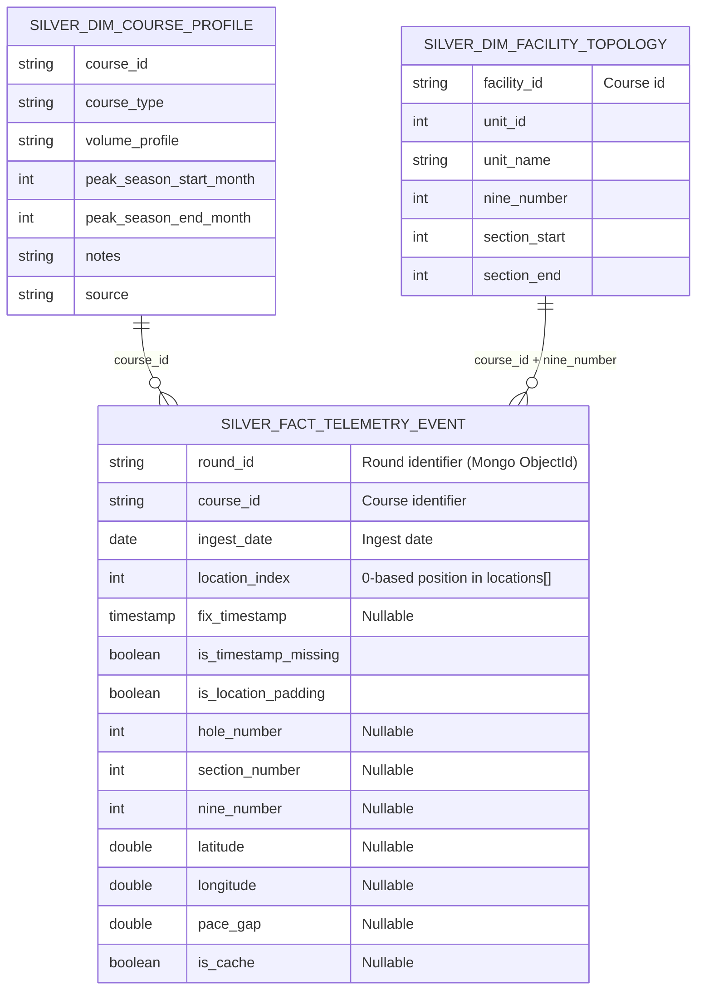
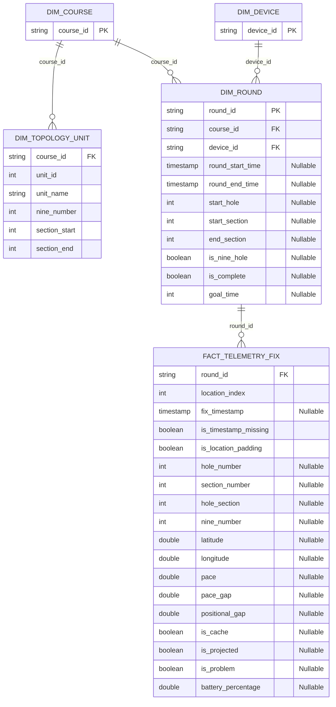

# Silver ERD (normalized view for exploration)

This ERD is meant to help you **explore and understand the Silver layer**.

It includes:
- **(A) Current physical Silver model** (what exists today)
- **(B) Proposed normalized exploration model** (recommended mental model / optional views)

> Gold is not the right place for this: Gold is analytics/aggregations. A normalized ERD belongs with Silver because Silver is your conformed “source of truth” layer.

---

## A) Current physical Silver model (as-built)

Key tables in `iceberg.silver` today:
- `fact_telemetry_event` (one row per location slot / GPS fix)
- `dim_facility_topology` (per-course unit/nine ranges; used to map sections → nines/units)
- `dim_course_profile` (human-entered course metadata)

Notes about keys:
- `fact_telemetry_event` does **not** have a single `event_id`. The effective uniqueness after Silver dedup is:
  - **(round_id, location_index, fix_timestamp)** (where `fix_timestamp` may be NULL)

Relationship caveat (topology):
- `dim_facility_topology` is really a **range** mapping by `section_number` (between `section_start` and `section_end`) plus `facility_id`.
- Silver ETL uses that range to infer `nine_number`. In Gold, we often join by `(course_id, nine_number)`.

---

## B) Proposed normalized exploration model (recommended)

This is the “clean mental model” that makes exploration easier. It can be implemented as:
- **Views** in Trino, or
- **dbt models** (in Silver, not Gold), or
- Just used as the ERD you reference while querying the single Silver fact table.

### How it maps to today’s Silver columns

- **`FACT_TELEMETRY_FIX`**: this is basically `silver.fact_telemetry_event` (already long/row-per-fix).
- **`DIM_ROUND`**: group `silver.fact_telemetry_event` by `round_id` and take a stable aggregation of round-level fields:
  - `MAX(start_hole)`, `MAX(goal_time)`, `BOOL_OR(is_complete)`, etc.
- **`DIM_DEVICE`**: distinct `device` values from Silver.
- **`DIM_TOPOLOGY_UNIT`**: `silver.dim_facility_topology` (already exists).
- **`DIM_COURSE_PROFILE`**: `silver.dim_course_profile` (already exists; optional metadata).

---

## Optional: DBML file for dbdiagram.io

If you prefer dbdiagram.io, use `pipeline/silver/erd.dbml` (included in repo) and paste it into dbdiagram to get an interactive diagram.

